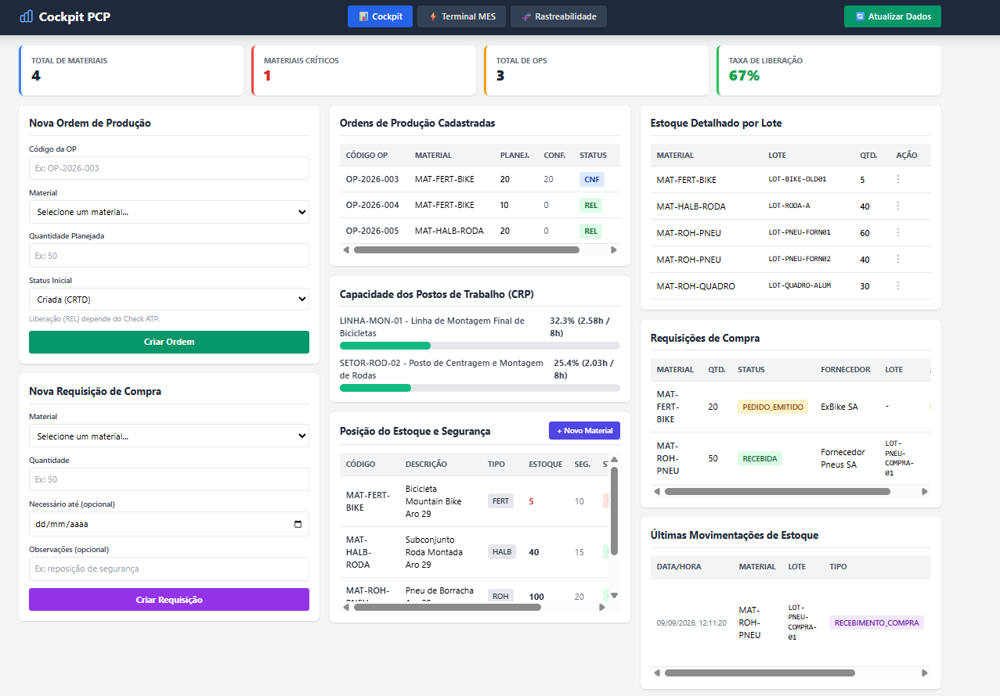
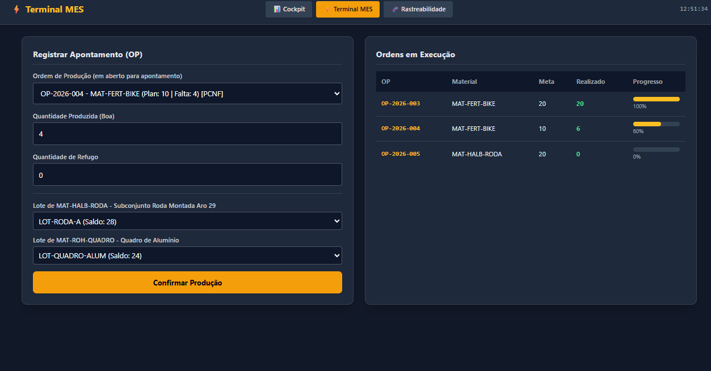
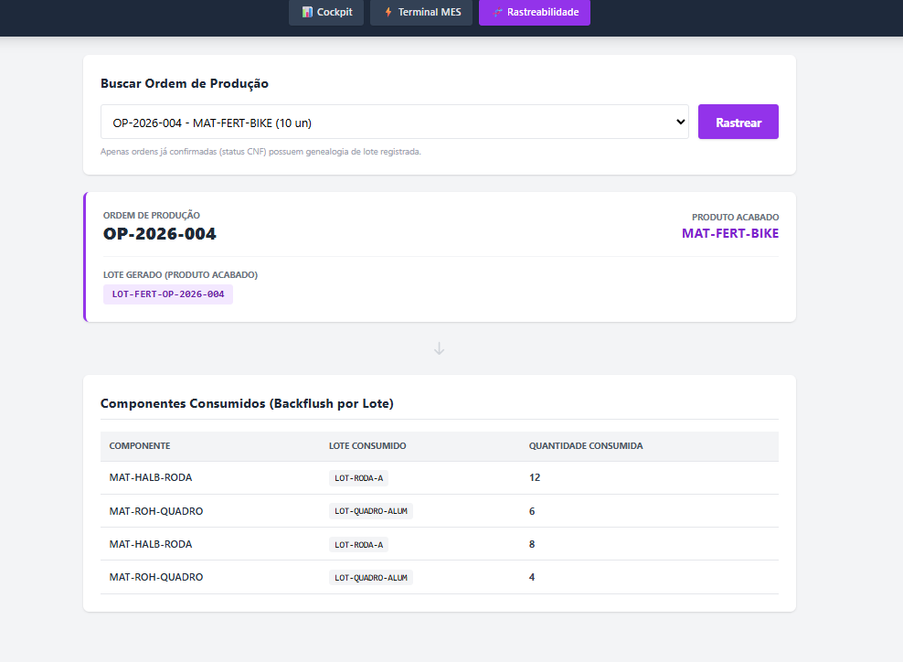

# 🏭 Sistema PCP Standalone


Sistema de **Planejamento e Controle de Produção (PCP)**, desenvolvido do zero em Python, inspirado nos módulos **SAP PP/MM** (MRP, CRP, Rastreabilidade de Lote e Compras). Projeto pessoal construído para aplicar na prática conceitos de MRP, controle de capacidade e gestão de estoque por lote — os mesmos fundamentos usados em ERPs de grande porte, só que num sistema enxuto e sob total controle do autor.

> Desenvolvido por [Ronaldo Lopes de Barros](https://github.com/ronaldolb) — profissional de PCP na indústria, em transição de carreira para desenvolvimento de software, autodidata em Python desde 2023.

---

## 📋 Sobre o projeto

Na minha rotina como profissional de PCP no chão de fábrica, usava diariamente sistemas como o SAP para planejar produção, controlar capacidade e rastrear lotes. Esse projeto nasceu da vontade de entender — e reconstruir — a lógica por trás dessas ferramentas: como um MRP realmente explode uma lista técnica (BOM), como um CRP calcula a carga de um posto de trabalho a partir de um roteiro, e como um sistema garante rastreabilidade de lote de ponta a ponta (do fornecedor até o produto acabado).

O resultado é um sistema PCP/MES funcional, com backend em **FastAPI** e frontend em **HTML + Tailwind CSS**, cobrindo o ciclo completo: cadastro de material → explosão de necessidades (MRP) → verificação de capacidade (CRP) → liberação e apontamento de ordens com rastreabilidade por lote → movimentações manuais de estoque → ciclo de compras.

---

## ✨ Funcionalidades

### 📦 Cadastro e Estoque
- Cadastro de materiais (Matéria-Prima, Semiacabado, Produto Acabado) com criação e edição direto pela interface
- Estoque segregado por **lote** (`batch_number`), com saldo consolidado por material
- Alerta automático de material crítico (abaixo do estoque de segurança)

### 🧮 MRP (Material Requirements Planning)
- Explosão de necessidades **multinível**, percorrendo recursivamente a Lista Técnica (BOM)
- Trava antiloop para estruturas de produto circulares
- Cálculo de necessidade líquida considerando estoque atual + estoque de segurança

### ⚙️ CRP (Capacity Requirements Planning)
- Cadastro de Postos de Trabalho (`WorkCenter`) e Roteiros de Fabricação (`Routing`)
- Cálculo de carga real por posto, a partir das ordens de produção abertas e seus tempos de setup/processamento
- Alerta visual de sobrecarga de capacidade

### 🏗️ Ordens de Produção e Chão de Fábrica
- Criação de OP vinculada a material (chave estrangeira, não texto solto)
- **Check ATP** na liberação: soma o saldo de todos os lotes do componente antes de liberar a ordem
- Apontamento de produção com **backflush automático** por lote específico escolhido pelo operador
- **Apontamento parcial**: a ordem fica como `PCNF` (parcialmente confirmada) até atingir a quantidade planejada e só então passa para `CNF`

### 🧬 Rastreabilidade por Lote (Batch Genealogy)
- Geração automática de lote do produto acabado a cada apontamento
- Vínculo completo entre o lote do produto acabado e os lotes dos componentes consumidos
- Tela dedicada de consulta de árvore de rastreabilidade (equivalente à transação `CHVW` do SAP)

### 🔄 Movimentação Manual de Estoque
- Transferência entre lotes
- Ajuste de inventário (entrada/saída com motivo obrigatório)
- Baixa por sucata/perda
- Log de auditoria completo de todas as movimentações

### 🛒 Compras
- Ciclo Requisição → Emissão de Pedido → Recebimento (equivalente a `ME51N` → `ME21N` → `MIGO` do SAP)
- Recebimento gera automaticamente um novo lote no estoque, já rastreável

---

## 🖥️ Telas

| Tela | Descrição |
|---|---|
| **Cockpit PCP** | Painel principal: KPIs, capacidade, ordens, estoque, requisições e movimentações |
| **Terminal MES** | Apontamento de produção pelo operador, com seleção de lote por componente |
| **Rastreabilidade** | Consulta da árvore de genealogia de lote de qualquer ordem confirmada |

### Cockpit PCP
Indicadores, ordens de produção em diferentes status (CNF, REL), carga dos postos de trabalho (CRP), estoque por lote e requisições de compra.



### Terminal MES
Apontamento parcial de uma ordem (6 de 10 já produzidas), com seleção do lote de cada componente e saldo atualizado pelo backflush.



### Rastreabilidade por lote
Genealogia do lote `LOT-FERT-OP-2026-004`: quais lotes de rodas e quadros foram consumidos em cada apontamento (12 + 8 rodas e 6 + 4 quadros para 10 bicicletas).



---

## 🛠️ Stack Técnica

| Camada | Tecnologia |
|---|---|
| Backend / API | Python 3, FastAPI, Uvicorn |
| ORM / Banco de Dados | SQLAlchemy, SQLite |
| Validação de Dados | Pydantic |
| Frontend | HTML5, JavaScript (vanilla), Tailwind CSS |
| Testes / CI | pytest, GitHub Actions |

---

## 📁 Estrutura do Projeto

```
meu_sistema_pcp/
├── .github/workflows/
│   └── tests.yml            # CI: roda os testes a cada push e pull request
├── core/                    # Regras de negócio (motores)
│   ├── mrp_engine.py        # Explosão de BOM / MRP
│   ├── crp_engine.py        # Cálculo de capacidade
│   ├── shop_floor.py        # Liberação e apontamento de OPs (com lote)
│   ├── inventory_ops.py     # Transferência, ajuste e sucata de estoque
│   └── purchasing.py        # Ciclo de compras
├── database/
│   ├── models.py            # Modelos SQLAlchemy (Material, BOM, Inventory, ProductionOrder, WorkCenter, Routing, BatchGenealogy, StockMovement, PurchaseRequisition)
│   └── connection.py        # Engine, sessão e Base declarativa
├── api/v1/
│   ├── endpoints.py         # Rotas da API REST
│   └── schemas.py           # Schemas Pydantic (request/response)
├── frontend/
│   ├── cockpit_pcp.html     # Painel principal
│   ├── terminal_mes.html    # Apontamento de chão de fábrica
│   └── rastreabilidade.html # Consulta de genealogia de lote
├── tests/
│   ├── conftest.py          # Fixtures: banco SQLite em memória e fábricas de dados
│   ├── test_mrp_engine.py   # Testes do motor de MRP
│   ├── test_crp_engine.py   # Testes do cálculo de capacidade
│   └── test_api.py          # Testes das rotas da API
├── main.py                  # Inicialização do FastAPI
├── seed.py                  # Carga inicial de dados de demonstração
├── pytest.ini               # Configuração do pytest
└── requirements-dev.txt     # Dependências para desenvolvimento e testes
```

---

## 🚀 Como executar

### Pré-requisitos
- Python 3.11+
- pip

### Passo a passo

```bash
# 1. Clone o repositório
git clone https://github.com/ronaldolb/meu_sistema_pcp.git
cd meu_sistema_pcp

# 2. Crie e ative o ambiente virtual
python -m venv .venv
.venv\Scripts\Activate.ps1      # Windows (PowerShell)
# source .venv/bin/activate     # Linux/Mac

# 3. Instale as dependências
pip install -r requirements.txt

# 4. Popule o banco de dados com dados de demonstração
python seed.py

# 5. Suba a API
uvicorn main:app --reload
```

A API estará disponível em `http://127.0.0.1:8000` (documentação interativa em `http://127.0.0.1:8000/docs`).

Abra os arquivos em `frontend/` com a extensão **Live Server** do VS Code (ou qualquer servidor estático) para acessar as telas.

---

## 🧪 Testes

São 19 testes automatizados com **pytest**, cobrindo o motor de MRP, o cálculo de capacidade (CRP) e as rotas da API. Cada teste roda num banco SQLite **em memória**, isolado: nada toca o `pcp.db` real e um teste nunca enxerga os dados de outro.

```bash
pip install -r requirements-dev.txt
pytest
```

O que é verificado:
- **MRP:** explosão multinível, soma de estoque de vários lotes, estoque de segurança, semiacabado usado em mais de um ramo e proteção contra BOM circular
- **CRP:** carga por posto, ordens confirmadas ignoradas, apontamento parcial, soma de várias ordens e posto com capacidade zero
- **API:** respostas 200, 201, 404 e 422 das rotas de MRP, materiais e capacidade

Os testes rodam automaticamente no **GitHub Actions** a cada push e pull request.

### 🐞 Bug encontrado pelos testes

Ao escrever os testes, a explosão multinível falhou: o MRP calculava só o produto acabado e **nunca explodia a lista técnica**.

- **Causa-raiz:** a trava antiloop recebia o material raiz já marcado como visitado, então a função recursiva retornava logo na primeira chamada. Além disso, o conjunto global de visitados impediria explodir um semiacabado usado em mais de um ramo da estrutura.
- **Correção:** a trava passou a considerar apenas o caminho do ramo atual. A BOM circular continua bloqueada, e componentes compartilhados são calculados em cada ramo.
- **Garantia:** os testes `test_explosao_multinivel_sem_estoque`, `test_semiacabado_usado_em_dois_lugares_explode_nos_dois` e `test_bom_circular_nao_trava_o_calculo` impedem que o problema volte.

---

## 🗺️ Roadmap

- [x] Apontamento parcial de ordens (status `PCNF`)
- [x] Testes automatizados (pytest) com integração contínua (GitHub Actions)
- [ ] Relatório de desvios (Planejado × Realizado)
- [ ] MRP gerando sub-ordens automáticas para itens semiacabados (HALB)
- [ ] MRP descontando o estoque uma única vez quando o mesmo componente aparece em vários ramos
- [ ] Deploy em nuvem com PostgreSQL

---

## 👤 Autor

**Ronaldo Lopes de Barros**
Profissional de PCP (Planejamento e Controle de Produção) na indústria | Estudante de Análise e Desenvolvimento de Sistemas | Desenvolvedor autodidata desde 2023

- GitHub: [@ronaldolb](https://github.com/ronaldolb)

---

## 📄 Licença

Este projeto está sob a licença MIT — sinta-se livre para estudar, usar e adaptar.